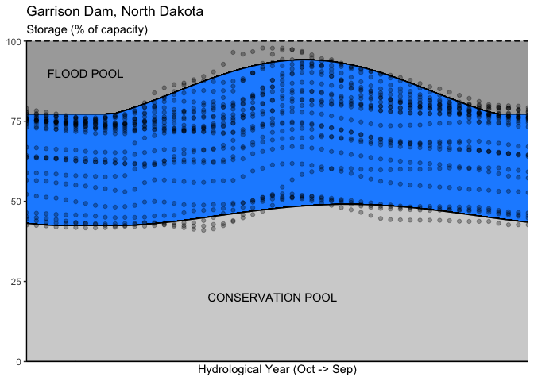

<!-- README.md is generated from README.Rmd. Please edit that file -->

# starfit 

<!-- badges: start -->

[](https://travis-ci.com/IMMM-SFA/starfit)
<!-- badges: end -->

`starfit` is a package that is designed to work with reservoir time
series data in ResOpsUS ([dataset](https://doi.org/10.5281/zenodo.5367382); [paper](https://www.nature.com/articles/s41597-022-01134-7)) to infer operating storage targets and
release functions.

## Installation

Install `starfit` using `devtools`:

``` r
devtools::install_github("IMMM-SFA/starfit")
```

#### Example - fit storage targets for Garrison Dam, North Dakota.

This example assumes that you have downloaded the [ResOpsUS dataset](https://doi.org/10.5281/zenodo.5367382). First, we’ll
use the `fit_targets()` function to infer parameters of weekly storage
targets for this dam (which is GRanD ID 753).

``` r
library(starfit)
fit_targets(your_path_to_ResOpsUS, dam_id = 753) -> fitted_targets
#> ℹ Fitting targets for dam 753: Garrison Dam

# take a look at the output:
str(fitted_targets)
#> List of 4
#>  $ id             : num 753
#>  $ weekly storage : tibble [1,306 × 3] (S3: tbl_df/tbl/data.frame)
#>   ..$ year   : num [1:1306] 1995 1995 1995 1995 1995 ...
#>   ..$ epiweek: num [1:1306] 1 2 3 4 5 6 7 8 9 10 ...
#>   ..$ s_pct  : num [1:1306] 74.1 73.3 72.9 72.5 72 ...
#>  $ NSR upper bound: num [1:5] 84.23 -3.83 -9.18 Inf 77.23
#>  $ NSR lower bound: num [1:5] 45.55 -2.8 -2.11 Inf 42.41
```

Here we can see that the `fit_targets()` function has generated a list
object with four items: (1) the GRanD ID of the reservoir, (2) a table
of weekly, observed storage (given as % of storage capacity), (3) flood
target parameters, and (4) conservation target parameters. Fitted
parameters for (3) and (4) can be converted to storage targets using
`convert_parameters_to_storage_targets()`.

``` r
fitted_targets[["NSR upper bound"]] %>% 
  convert_parameters_to_targets("flood") -> flood_targets

fitted_targets[["NSR lower bound"]] %>% 
  convert_parameters_to_targets("conservation") -> conservation_targets
```

Then we can combine these targets with the weekly storage data to view
the inferred rule curves and verify the fit:

``` r
library(dplyr)
#> 
#> Attaching package: 'dplyr'
#> The following objects are masked from 'package:stats':
#> 
#>     filter, lag
#> The following objects are masked from 'package:base':
#> 
#>     intersect, setdiff, setequal, union
library(ggplot2)

fitted_targets[["weekly storage"]] %>% 
  left_join(flood_targets, by = "epiweek") %>% 
  left_join(conservation_targets, by = "epiweek") %>% 
  mutate(capacity = 100) %>%
  mutate(hydweek = factor(epiweek, levels = c(40:52, 1:39))) %>%
  ggplot(aes(epiweek, s_pct, group = year)) +
  geom_ribbon(aes(ymin = flood, ymax = capacity),
              fill = "darkgrey", alpha = 0.7, col = "black", linetype = 2) +
  geom_ribbon(aes(ymin = conservation, ymax = flood),
              fill = "dodgerblue", alpha = 0.7, col = "black", linetype = 1) +
  geom_ribbon(aes(ymin = 0, ymax = conservation),
              fill = "lightgrey", col = "black", linetype = 1, alpha = 0.7) +
  geom_point(alpha = 0.3) +
  scale_x_discrete(expand = c(0, 0)) +
  scale_y_continuous(expand = c(0, 0)) +
  theme_classic() +
  theme(axis.text.x = element_blank(),
        axis.ticks.x = element_blank()) +
  labs(title = "Garrison Dam, North Dakota", subtitle = "Storage (% of capacity)",
       y = NULL, x = "Hydrological Year (Oct -> Sep)") +
  annotate("text", label = "FLOOD POOL", x = 7, y = 90) +
  annotate("text", label = "CONSERVATION POOL", x = 26, y = 20)
```


